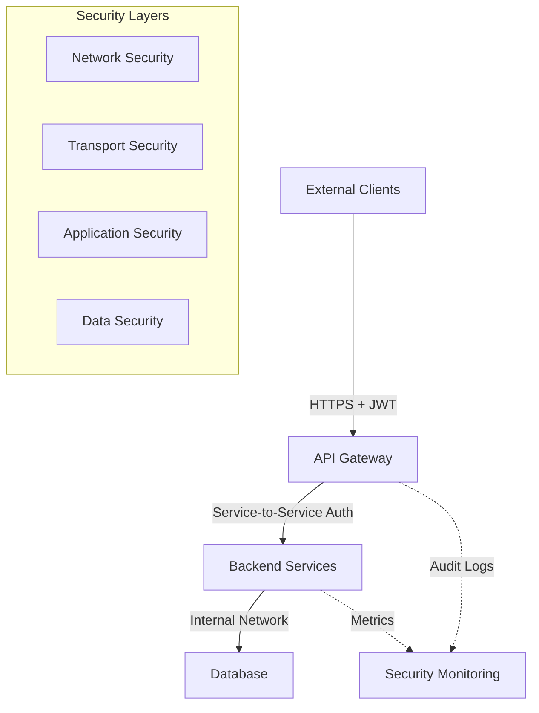
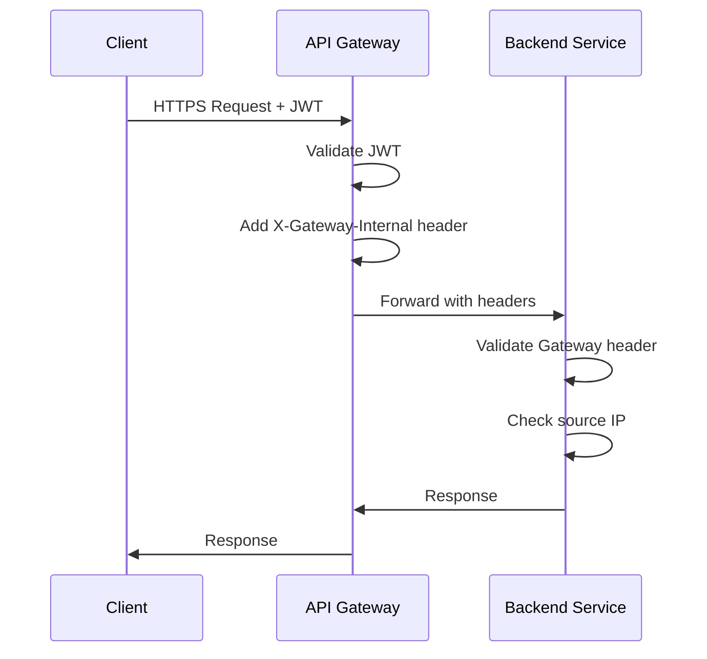
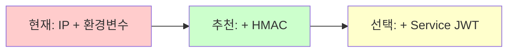
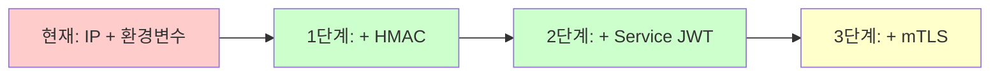
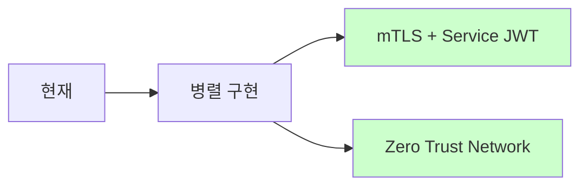

# 🛡️ Gateway Security Guide

**Civic Insights API Gateway 보안 아키텍처 및 구현 가이드**

---

## 📋 **목차**

1. [보안 개요](#-보안-개요)
2. [현재 구현 상태](#-현재-구현-상태)
3. [보안 레벨별 방어 효과](#-보안-레벨별-방어-효과)
4. [상황별 적합성 비교](#-상황별-적합성-비교)
5. [보안 취약점 및 공격 시나리오](#-보안-취약점-및-공격-시나리오)
6. [단계별 보안 강화 로드맵](#-단계별-보안-강화-로드맵)
7. [구현 가이드](#-구현-가이드)
8. [운영 가이드](#-운영-가이드)

---

## 🔒 **보안 개요**

### **마이크로서비스 보안 원칙**



### **핵심 보안 목표**
- **인증 (Authentication)**: 요청자가 누구인지 확인
- **인가 (Authorization)**: 요청자가 무엇을 할 수 있는지 제어
- **무결성 (Integrity)**: 데이터 변조 방지
- **기밀성 (Confidentiality)**: 민감 정보 보호
- **가용성 (Availability)**: 서비스 중단 방지

---

## 🚀 **현재 구현 상태**

### **Level 1: 기본 보안 (현재 적용)**

#### **IP 기반 접근 제어**
```java
// GatewayOnlyFilter.java
private static final List<String> ALLOWED_IPS = Arrays.asList(
    "127.0.0.1", "::1", "localhost",
    "192.168.*", "10.*", "172.16.*-172.31.*"
);
```

#### **환경변수 기반 토큰**
```properties
# Backend Services
app.security.gateway-token=${GATEWAY_SECRET_TOKEN:civic-insights-gateway-v1}
```

#### **게이트웨이 헤더 검증**
```yaml
# API Gateway
filters:
  - AddRequestHeader=X-Gateway-Internal, ${GATEWAY_SECRET_TOKEN}
```

### **보안 흐름**


---

## 📊 **보안 레벨별 방어 효과**

| 공격 시나리오 | Level 1<br/>(IP + 환경변수) | Level 2<br/>(+ HMAC) | Level 3<br/>(+ mTLS) | Level 4<br/>(+ Service JWT) |
|-------------|---------------------------|---------------------|---------------------|---------------------------|
| **직접 API 호출** | ✅ 차단 | ✅ 차단 | ✅ 차단 | ✅ 차단 |
| **토큰 탈취 후 재사용** | ❌ 뚫림 | ✅ 차단 | ✅ 차단 | ✅ 차단 |
| **IP 스푸핑** | ❌ 뚫림 | ❌ 뚫림 | ✅ 차단 | ✅ 차단 |
| **리플레이 공격** | ❌ 뚫림 | ✅ 차단 | ✅ 차단 | ✅ 차단 |
| **중간자 공격 (MITM)** | ❌ 뚫림 | ❌ 뚫림 | ✅ 차단 | ✅ 차단 |
| **내부 네트워크 침투** | ❌ 뚫림 | 🟡 부분방어 | ✅ 차단 | ✅ 차단 |
| **컨테이너 탈취** | ❌ 뚫림 | 🟡 부분방어 | ✅ 차단 | ✅ 차단 |
| **환경변수 노출** | ❌ 뚫림 | ✅ 차단 | ✅ 차단 | ✅ 차단 |
| **로그 파일 노출** | ❌ 뚫림 | ✅ 차단 | ✅ 차단 | ✅ 차단 |
| **메모리 덤프 공격** | ❌ 뚫림 | ✅ 차단 | ✅ 차단 | ✅ 차단 |

### **보안 강도 점수**
- **Level 1**: 🔒🔒 (40% 보안)
- **Level 2**: 🔒🔒🔒🔒 (80% 보안)  
- **Level 3**: 🔒🔒🔒🔒🔒 (95% 보안)
- **Level 4**: 🔒🔒🔒🔒🔒 (99% 보안)

---

## 📊 **상황별 적합성 비교**

| 기준 | HMAC | Service JWT | mTLS |
|------|------|-------------|------|
| **구현 복잡도** | ⭐ 매우 쉬움 | ⭐⭐ 보통 | ⭐⭐⭐⭐⭐ 매우 복잡 |
| **운영 복잡도** | ⭐ 매우 쉬움 | ⭐⭐ 보통 | ⭐⭐⭐⭐⭐ 매우 복잡 |
| **보안 강도** | ⭐⭐⭐⭐ 높음 | ⭐⭐⭐⭐⭐ 최고 | ⭐⭐⭐⭐⭐ 최고 |
| **성능 오버헤드** | ⭐ 최소 | ⭐⭐ 적음 | ⭐⭐⭐ 보통 |
| **디버깅 용이성** | ⭐⭐⭐⭐⭐ 매우 쉬움 | ⭐⭐⭐⭐ 쉬움 | ⭐⭐ 어려움 |
| **개발 속도** | ⭐⭐⭐⭐⭐ 매우 빠름 | ⭐⭐⭐⭐ 빠름 | ⭐⭐ 느림 |
| **인프라 요구사항** | ⭐ 최소 | ⭐⭐ 적음 | ⭐⭐⭐⭐⭐ 매우 많음 |
| **확장성** | ⭐⭐⭐⭐ 좋음 | ⭐⭐⭐⭐⭐ 매우 좋음 | ⭐⭐⭐ 보통 |
| **표준 준수** | ⭐⭐⭐ 보통 | ⭐⭐⭐⭐⭐ 매우 좋음 | ⭐⭐⭐⭐⭐ 매우 좋음 |

### **조직 규모별 권장사항**

#### **스타트업 / 중소기업 (팀 규모: 1-20명)**

- **즉시 적용**: HMAC 서명
- **조건부 적용**: Service JWT (보안 요구사항이 높은 경우)
- **비추천**: mTLS (운영 부담 과다)

#### **중견기업 (팀 규모: 20-100명)**

- **단계적 적용**: HMAC → Service JWT → mTLS
- **우선순위**: 개발 생산성 vs 보안 요구사항

#### **대기업 / 금융권 (팀 규모: 100명+)**

- **목표**: 최고 수준 보안
- **접근**: 병렬 개발로 빠른 적용
- **추가**: Service Mesh, Zero Trust

---

## 🚨 **보안 취약점 및 공격 시나리오**

### **현재 Level 1의 주요 취약점**

#### **1. 토큰 노출 시나리오**

##### **컨테이너 환경에서의 노출**
```bash
# 🚨 위험: 컨테이너 환경변수 조회
docker inspect <container_id> | grep -i gateway
kubectl get pods <pod-name> -o yaml | grep -A 10 env

# 🚨 위험: 프로세스 환경변수 노출
ps auxe | grep GATEWAY_SECRET_TOKEN
```

##### **로그 파일 노출**
```bash
# 🚨 위험: 잘못된 로깅
2025-01-08 ERROR [...] Gateway token validation failed: GATEWAY_SECRET_TOKEN=abc123...

# 🚨 위험: Debug 모드 환경변수 덤프
DEBUG: Environment: {GATEWAY_SECRET_TOKEN=secret123, ...}
```

##### **CI/CD 파이프라인 침투**
```yaml
# 🚨 위험: GitHub Actions secrets 노출
env:
  GATEWAY_SECRET_TOKEN: ${{ secrets.GATEWAY_TOKEN }}  # 로그에 노출 가능
```

#### **2. 네트워크 공격 시나리오**

##### **IP 스푸핑**
```bash
# 🚨 공격: ARP 스푸핑으로 Gateway IP 위조
arp -s 192.168.1.100 aa:bb:cc:dd:ee:ff
```

##### **Docker 네트워크 내부 공격**
```yaml
# 🚨 공격: 같은 네트워크에서 Gateway 행세
services:
  malicious-container:
    networks:
      - gateway-network
    command: |
      curl -H "X-Gateway-Internal: stolen-token" \
           http://backend:8080/api/articles
```

##### **프록시/로드밸런서 우회**
```bash
# 🚨 공격: X-Forwarded-For 헤더 조작
curl -H "X-Forwarded-For: 127.0.0.1" \
     -H "X-Gateway-Internal: stolen-token" \
     http://backend:8080/api/articles
```

#### **3. 내부 침투 공격**

##### **컨테이너 탈취 후 수평 이동**
```bash
# 🚨 공격 시나리오
# 1. 하나의 컨테이너 탈취
env | grep GATEWAY_SECRET_TOKEN

# 2. 내부 네트워크 스캔
nmap -sT 10.0.0.0/24 -p 8080,8001

# 3. 다른 서비스 직접 공격
curl -H "X-Gateway-Internal: stolen-token" \
     http://10.0.0.5:8080/api/sensitive-data
```

---

## 🛣️ **단계별 보안 강화 로드맵**

### **Phase 1: 즉시 적용 (1-2주)**

#### **HMAC 서명 구현**
```java
// Gateway에서 서명 생성
String data = gatewayId + ":" + timestamp + ":" + requestUri;
String signature = hmacSha256(gatewaySecret, data);

// Backend에서 서명 검증
String expectedSig = hmacSha256(gatewaySecret, gatewayId + timestamp + uri);
if (!expectedSig.equals(receivedSig)) {
    return ResponseEntity.status(403).body("Invalid signature");
}
```

#### **예상 보안 향상**
- 🔒 토큰 탈취 후 재사용 방지
- 🔒 리플레이 공격 차단
- 🔒 환경변수 노출 시에도 서명 위조 불가

### **Phase 2: 단기 구현 (1-2개월)**

#### **Service JWT 도입**
```java
// JWT 클레임 예시
{
  "iss": "civic-insights-gateway",
  "aud": "civic-sights-main",
  "iat": 1641234567,
  "exp": 1641235467,  // 15분 후 만료
  "service": "gateway",
  "request_id": "req-123",
  "source_ip": "10.0.0.1",
  "scope": ["articles:read", "articles:write"]
}
```

#### **예상 보안 향상**
- 🔒 세밀한 권한 제어
- 🔒 요청별 컨텍스트 추적
- 🔒 자동 만료 시간 관리

### **Phase 3: 중장기 구현 (3-6개월)**

#### **mTLS 인프라 구축**
```yaml
# 인증서 자동 관리
apiVersion: cert-manager.io/v1
kind: Certificate
metadata:
  name: gateway-service-cert
spec:
  secretName: gateway-service-tls
  duration: 2160h # 90일
  renewBefore: 360h # 15일 전 갱신
```

#### **예상 보안 향상**
- 🔒 네트워크 레벨 암호화
- 🔒 상호 인증서 검증
- 🔒 중간자 공격 완전 차단

---

## 🔧 **구현 가이드**

### **HMAC 서명 구현 (권장 우선순위 #1)**

#### **1. Gateway Filter 구현**
```java
@Component
public class HmacGatewayFilter implements GatewayFilter {
    
    @Value("${gateway.security.secret}")
    private String gatewaySecret;
    
    @Override
    public Mono<Void> filter(ServerWebExchange exchange, GatewayFilterChain chain) {
        String timestamp = String.valueOf(Instant.now().getEpochSecond());
        String requestUri = exchange.getRequest().getURI().getPath();
        String gatewayId = "civic-insights-gateway";
        
        String signature = generateHmacSignature(gatewayId, timestamp, requestUri);
        
        ServerHttpRequest modifiedRequest = exchange.getRequest().mutate()
            .header("X-Gateway-ID", gatewayId)
            .header("X-Gateway-Timestamp", timestamp)
            .header("X-Gateway-Signature", signature)
            .build();
            
        return chain.filter(exchange.mutate().request(modifiedRequest).build());
    }
    
    private String generateHmacSignature(String gatewayId, String timestamp, String uri) {
        try {
            String data = gatewayId + ":" + timestamp + ":" + uri;
            Mac mac = Mac.getInstance("HmacSHA256");
            SecretKeySpec secretKey = new SecretKeySpec(
                gatewaySecret.getBytes(StandardCharsets.UTF_8), "HmacSHA256");
            mac.init(secretKey);
            byte[] signature = mac.doFinal(data.getBytes(StandardCharsets.UTF_8));
            return Base64.getEncoder().encodeToString(signature);
        } catch (Exception e) {
            throw new RuntimeException("Failed to generate HMAC signature", e);
        }
    }
}
```

#### **2. Backend 검증 필터**
```java
@Component
@Order(1)
public class HmacGatewayOnlyFilter extends OncePerRequestFilter {
    
    @Value("${app.security.gateway-secret}")
    private String gatewaySecret;
    
    @Value("${app.security.timestamp-tolerance:300}") // 5분
    private long timestampToleranceSeconds;
    
    @Override
    protected void doFilterInternal(HttpServletRequest request, 
                                   HttpServletResponse response, 
                                   FilterChain filterChain) throws ServletException, IOException {
        
        String gatewayId = request.getHeader("X-Gateway-ID");
        String timestamp = request.getHeader("X-Gateway-Timestamp");
        String signature = request.getHeader("X-Gateway-Signature");
        String requestUri = request.getRequestURI();
        
        // 1. 헤더 존재 검증
        if (gatewayId == null || timestamp == null || signature == null) {
            sendForbiddenResponse(response, "Missing gateway headers");
            return;
        }
        
        // 2. 타임스탬프 검증 (리플레이 공격 방지)
        try {
            long requestTime = Long.parseLong(timestamp);
            long currentTime = Instant.now().getEpochSecond();
            if (Math.abs(currentTime - requestTime) > timestampToleranceSeconds) {
                sendForbiddenResponse(response, "Request timestamp is too old or too new");
                return;
            }
        } catch (NumberFormatException e) {
            sendForbiddenResponse(response, "Invalid timestamp format");
            return;
        }
        
        // 3. HMAC 서명 검증
        String expectedSignature = generateHmacSignature(gatewayId, timestamp, requestUri);
        if (!MessageDigest.isEqual(expectedSignature.getBytes(), signature.getBytes())) {
            sendForbiddenResponse(response, "Invalid gateway signature");
            return;
        }
        
        filterChain.doFilter(request, response);
    }
    
    // generateHmacSignature() 메서드는 Gateway와 동일
}
```

### **Service JWT 구현 (권장 우선순위 #2)**

#### **1. JWT 생성 (Gateway)**
```java
@Service
public class ServiceJwtService {
    
    @Value("${gateway.jwt.secret}")
    private String jwtSecret;
    
    @Value("${gateway.jwt.expiration:900}") // 15분
    private long jwtExpirationSeconds;
    
    public String generateServiceJwt(String audience, String sourceIp) {
        Instant now = Instant.now();
        
        return Jwts.builder()
            .setIssuer("civic-insights-gateway")
            .setAudience(audience)
            .setSubject("service-access")
            .setIssuedAt(Date.from(now))
            .setExpiration(Date.from(now.plusSeconds(jwtExpirationSeconds)))
            .claim("source_ip", sourceIp)
            .claim("request_id", UUID.randomUUID().toString())
            .claim("scope", Arrays.asList("service:access"))
            .signWith(SignatureAlgorithm.HS256, jwtSecret)
            .compact();
    }
}
```

#### **2. JWT 검증 (Backend)**
```java
@Component
@Order(2)
public class ServiceJwtFilter extends OncePerRequestFilter {
    
    @Value("${app.security.service-jwt-secret}")
    private String jwtSecret;
    
    @Override
    protected void doFilterInternal(HttpServletRequest request, 
                                   HttpServletResponse response, 
                                   FilterChain filterChain) throws ServletException, IOException {
        
        String serviceJwt = request.getHeader("X-Service-JWT");
        
        if (serviceJwt == null) {
            sendForbiddenResponse(response, "Missing service JWT");
            return;
        }
        
        try {
            Claims claims = Jwts.parser()
                .setSigningKey(jwtSecret)
                .parseClaimsJws(serviceJwt)
                .getBody();
                
            // 추가 검증
            String audience = claims.getAudience();
            if (!"civic-sights-main".equals(audience)) {
                sendForbiddenResponse(response, "Invalid JWT audience");
                return;
            }
            
            filterChain.doFilter(request, response);
            
        } catch (JwtException e) {
            sendForbiddenResponse(response, "Invalid service JWT: " + e.getMessage());
        }
    }
}
```

---

## 🔧 **운영 가이드**

### **환경변수 관리**

#### **개발 환경**
```bash
# .env.local
GATEWAY_SECRET_TOKEN=dev-token-do-not-use-in-production
GATEWAY_HMAC_SECRET=dev-hmac-secret-change-in-production
```

#### **운영 환경**
```bash
# Kubernetes Secret
kubectl create secret generic gateway-secrets \
  --from-literal=GATEWAY_SECRET_TOKEN="$(openssl rand -base64 32)" \
  --from-literal=GATEWAY_HMAC_SECRET="$(openssl rand -base64 32)"
```

### **모니터링 및 알람**

#### **보안 이벤트 모니터링**
```yaml
# Prometheus Alerts
groups:
- name: gateway-security
  rules:
  - alert: HighGatewayAuthFailures
    expr: rate(gateway_auth_failures_total[5m]) > 10
    for: 1m
    annotations:
      summary: "High rate of gateway authentication failures"
      
  - alert: SuspiciousIPActivity
    expr: rate(gateway_requests_by_ip[5m]) > 100
    for: 2m
    annotations:
      summary: "Suspicious high request rate from single IP"
```

#### **로그 분석**
```json
{
  "timestamp": "2025-01-08T12:00:00Z",
  "level": "WARN",
  "service": "civic-sights-main",
  "event": "gateway_auth_failure",
  "source_ip": "192.168.1.100",
  "uri": "/api/articles",
  "reason": "invalid_signature",
  "headers": {
    "X-Gateway-ID": "civic-insights-gateway",
    "X-Gateway-Timestamp": "1641649200"
  }
}
```

### **보안 사고 대응**

#### **토큰 탈취 의심 시**
```bash
# 1. 즉시 토큰 순환 (롤링 업데이트)
kubectl patch deployment gateway \
  -p '{"spec":{"template":{"metadata":{"annotations":{"kubectl.kubernetes.io/restartedAt":"'$(date +%Y-%m-%dT%H:%M:%S%z)'"}}}}}'

# 2. 새로운 토큰으로 교체
kubectl patch secret gateway-secrets \
  --type='json' \
  -p='[{"op": "replace", "path": "/data/GATEWAY_SECRET_TOKEN", "value":"'$(openssl rand -base64 32 | base64 -w 0)'"}]'

# 3. 모든 서비스 재시작
kubectl rollout restart deployment/civic-sights-main
kubectl rollout restart deployment/civic-insights-auth
```

#### **비정상 트래픽 감지 시**
```bash
# 1. 특정 IP 차단
kubectl apply -f - <<EOF
apiVersion: networking.k8s.io/v1
kind: NetworkPolicy
metadata:
  name: block-suspicious-ip
spec:
  podSelector:
    matchLabels:
      app: gateway
  policyTypes:
  - Ingress
  ingress:
  - from:
    - ipBlock:
        cidr: 0.0.0.0/0
        except:
        - 192.168.1.100/32  # 차단할 IP
EOF

# 2. 임시 Rate Limiting 강화
kubectl patch configmap gateway-config \
  --patch '{"data":{"rate-limit":"10"}}'  # 초당 10 요청으로 제한
```

---

## 🎯 **결론 및 권장사항**

### **즉시 실행 항목 (이번 주)**
1. ✅ **환경변수 기반 토큰** (완료)
2. 🔄 **HMAC 서명 구현** (진행 중)
3. 📊 **보안 모니터링 설정**

### **단기 목표 (다음 달)**
1. 🔐 **Service JWT 구현**
2. 🚨 **보안 사고 대응 프로세스 구축**
3. 📋 **보안 감사 체크리스트 작성**

### **중장기 목표 (3-6개월)**
1. 🏗️ **mTLS 인프라 구축** (필요시)
2. 🌐 **Service Mesh 도입** (확장성 고려)
3. 🔒 **Zero Trust 아키텍처** (최고 보안)

### **핵심 메시지**
> **"완벽한 보안은 없다. 하지만 단계적이고 지속적인 개선을 통해 99%의 공격을 막을 수 있다."**

**현실적인 접근**: Level 1 → Level 2 (HMAC) → Level 3 (Service JWT) → Level 4 (mTLS)

**비용 대비 효과**: HMAC 구현으로 80%의 보안 향상을 20%의 노력으로 달성 가능! 🚀

---

## 📚 **참고 자료**

- [OWASP API Security Top 10](https://owasp.org/www-project-api-security/)
- [RFC 7515: JSON Web Signature (JWS)](https://tools.ietf.org/html/rfc7515)
- [RFC 2104: HMAC: Keyed-Hashing for Message Authentication](https://tools.ietf.org/html/rfc2104)
- [Spring Cloud Gateway Security](https://docs.spring.io/spring-cloud-gateway/docs/current/reference/html/#security)
- [Microservices Security Patterns](https://microservices.io/patterns/security/)

---

**📅 작성일**: 2025-01-08  
**✍️ 작성자**: Civic Insights Development Team  
**🔄 버전**: 1.0  
**📋 상태**: 초안